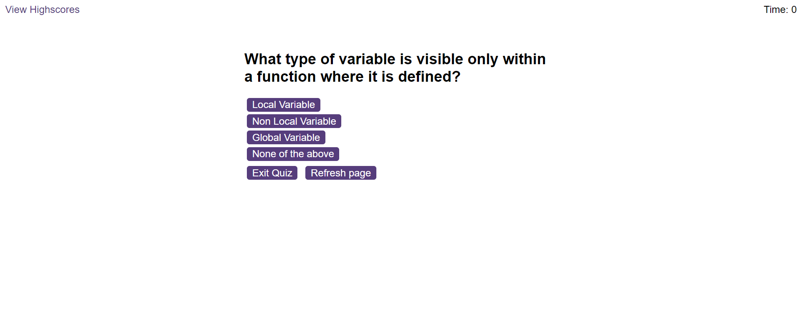

# Code for quiz game

# Module 6 Challenge Web APIs: Code Quiz

## My Task

To complete a coding assessment.
A typical coding assessment is a combination of multiple-choice questions and interactive coding challenges. 

This will be done when I build a timed coding quiz with multiple-choice questions.
The app will run be expected to run in the browser, and will feature dynamically updated HTML and CSS powered by JavaScript code that I write. 
It will have a clean, polished, and responsive user interface.


## User Story

```
AS A coding boot camp student
I WANT to take a timed quiz on JavaScript fundamentals that stores high scores
SO THAT I can gauge my progress compared to my peers
```

## Expectations

To create a code quiz that contains the following requirements:

* A start button that when clicked a timer starts and the first question appears.
 
  * Questions contain buttons for each answer.
  * 
  * When answer is clicked, the next question appears
  * 
  * If the answer clicked was incorrect then subtract time from the clock

* The quiz should end when all questions are answered or the timer reaches 0.

  * When the game ends, it should display their score and give the user the ability to save their initials and their score
  
## Demonstration

The following animation demonstrates the application functionality:

[deployed link]( https://lawzstopwar.github.io/Challenge6-Quiz-Game/)





